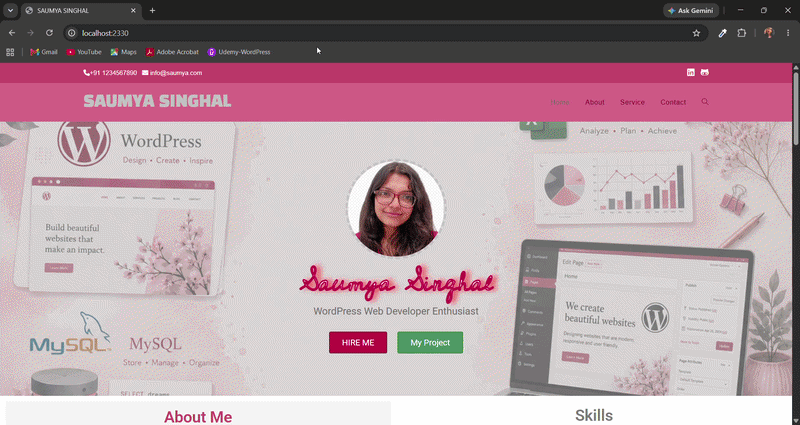
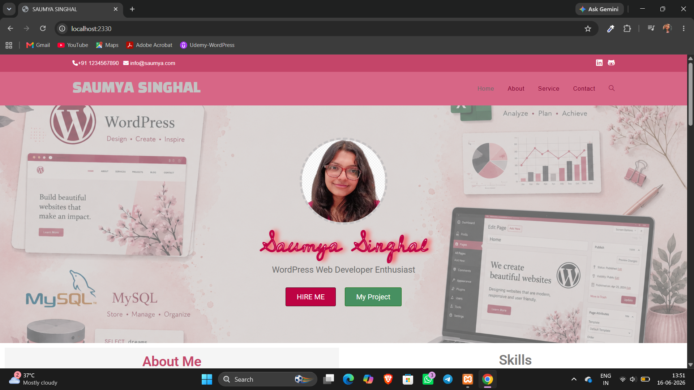
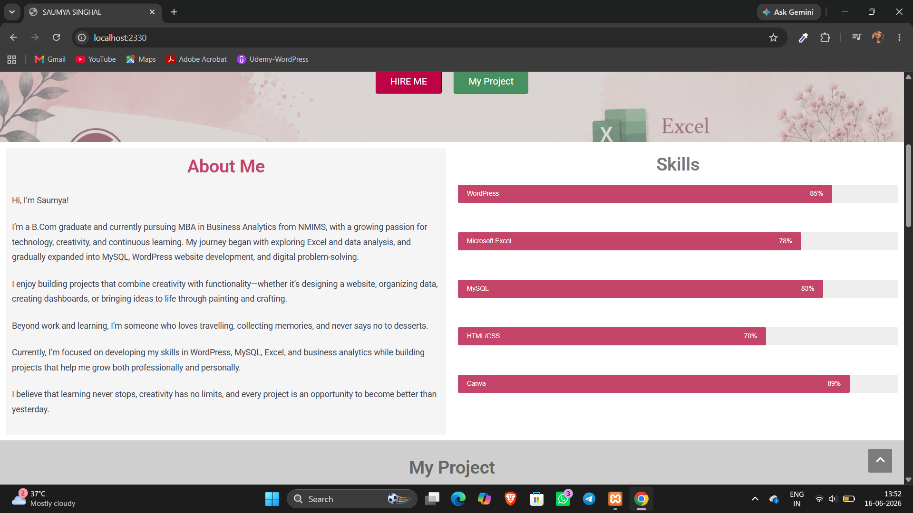
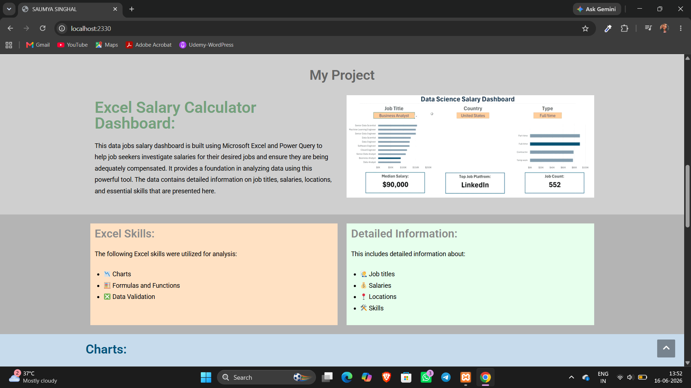
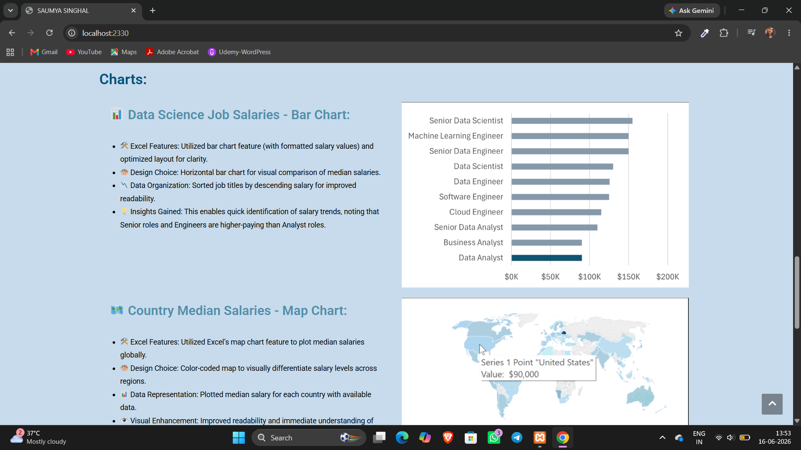
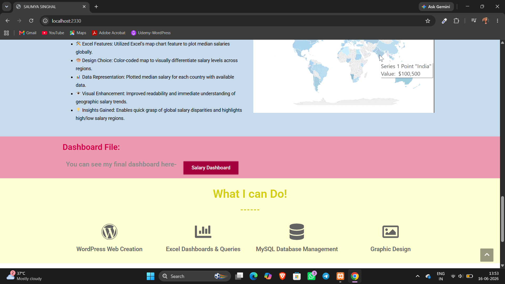

# Personal Portfolio Website

## 📌 Overview
A responsive personal portfolio website developed using WordPress to showcase my skills, and projects. The website features a clean and user-friendly interface with dedicated sections for About Me, Skills, Services, Projects, and Contact Information.

### Website File
You can see a video walkthrough of the website with every feature in use here- [▶️ Watch Demo Video](WordPress_Personal_Portfolio_website.mp4)

### 🚀 Features
* Responsive and modern design
* About Me section
* Skills showcase
* Services section
* Project portfolio display
* Contact information section
* Easy navigation and user-friendly interface

### 🛠️ Tools & Technologies
* WordPress
* XAMPP
* Elementor
* Ocean WP
* MySQL
* CSS

### ⭐Hero Section

The Hero Section serves as the landing area of the portfolio website, introducing my professional identity as a WordPress Web Developer Enthusiast. It features a personalized design with a profile image, clear navigation menu, contact information, and prominent call-to-action buttons for hiring inquiries and project exploration. The section is designed to create a strong first impression while providing quick access to key areas of the website.

### 👤About Me & Skills Section

This section introduces my academic background, interests, and career aspirations while highlighting the technical skills I have developed through learning and project work. It provides visitors with an overview of my journey from commerce and business analytics to web development and data management. The skills section visually represents my proficiency in WordPress, MySQL, Microsoft Excel, HTML/CSS, and Canva through interactive progress bars, making it easy to understand my areas of expertise at a glance.

### My Project
    

This section features a collection of my projects in web development and data analytics. Each project reflects my technical skills, problem-solving approach, and ability to transform data and ideas into practical solutions.
* 📊 Data Science Salary Dashboard – Interactive Excel dashboard analyzing salary trends, job roles, locations, and required skills in the data science industry.
* 🌐 Personal Portfolio Website – Responsive WordPress portfolio showcasing my skills, projects, certifications, and contact information.
* 🗄️ MySQL Database Project – Database queries and analysis for efficient data management and reporting.

* Also a button is added in the website to directly see my Salary Dashboard under Dashboard File:

